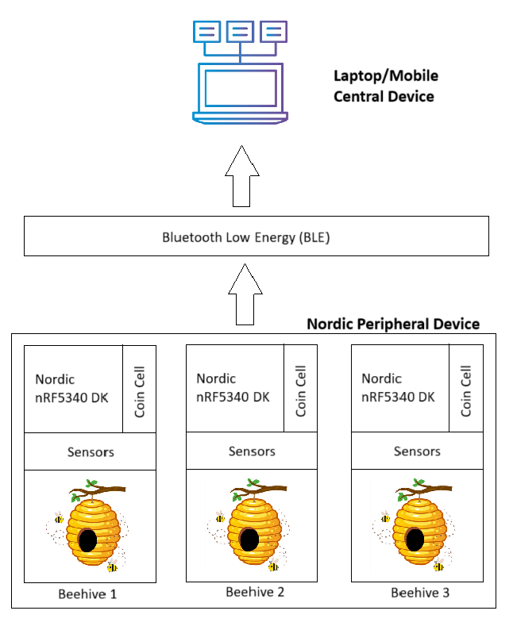
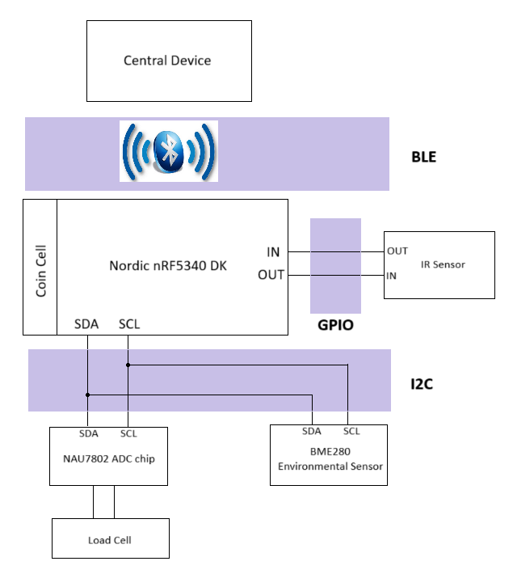
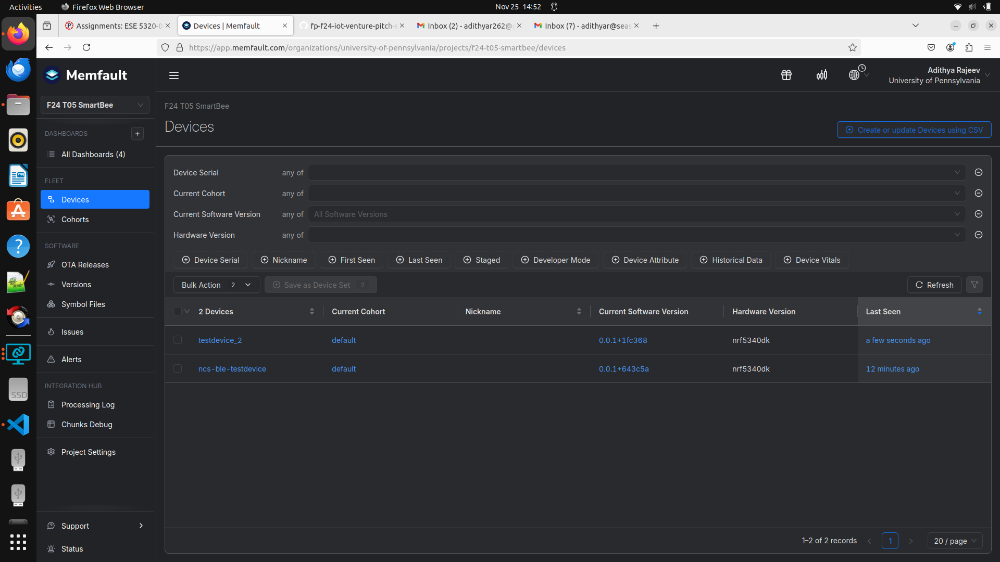
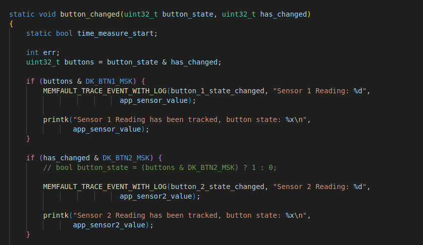

[](https://classroom.github.com/a/URrFMA27)
# FP-F24 IoT Venture Pitch
## ESE5180: IoT Wireless, Security, & Scaling


## 1 GitHub URL

https://github.com/ese5180/fp-f24-iot-venture-pitch-smartbeehive

## 2 Team Selection

```markdown
Team Name: SmartBee
```

| Team Member Name | Email Address            |
|------------------|--------------------------|
| Adithya Rajeev   | adithyar@seas.upenn.edu  |
| Tarush Sharma    | tarushs@seas.upenn.edu   |

When will you have your 30-minute weekly team meeting?

**Tuesday 3pm - 4pm**

## IoT-Enabled Beehive Monitoring System

The IoT-enabled beehive monitoring system is designed to provide real-time insights into the health and activity of beehives through a network of sensors and BLE connectivity. From a software standpoint, the system integrates a variety of sensors, including environmental monitors (temperature, humidity) and weight sensors, to gather data continuously.

Data collected from the beehives is transmitted via Bluetooth Low Energy (BLE) to a mobile app powered by the BlueSee platform, which facilitates data visualization and remote monitoring. The software features a user-friendly interface that allows beekeepers to view real-time metrics, receive alerts for unusual hive conditions, and track trends over time.

Additionally, the system implements cloud connectivity to store historical data and perform analytics, enabling proactive hive management and enhancing overall hive productivity.

### Users of the IoT-Enabled Beehive Monitoring System

1. **Beekeepers**:  
   The primary users of the system are beekeepers who manage beehives for honey production, pollination services, or conservation efforts. They utilize the system to monitor hive conditions, track bee activity, and receive alerts about any potential issues, such as temperature fluctuations or abnormal weight changes, which can indicate problems in the hive.

2. **Researchers**:  
   Researchers studying bee behavior, health, and environmental impact can benefit from the data collected by the system. They can analyze trends over time, conduct experiments, and gain insights into the factors affecting bee populations, thereby contributing to conservation efforts and sustainable beekeeping practices.

3. **Hobbyists and Enthusiasts**:  
   Individuals interested in beekeeping as a hobby can use the system to enhance their understanding of hive management. The data insights can help them make informed decisions to promote the health and productivity of their beehives.

This diverse user base highlights the versatility and potential impact of the IoT-enabled beehive monitoring system across various fields and interests.


## 3 Reading & Research

Nothing to submit for this section!

## 4 Concept Development

### 4.1 Target Market & Demographics

```markdown
Who will be using your product? 
```
- **Beekeepers of all levels**: Hobbyists, sideliners, and commercial beekeepers will all benefit from the real-time data and insights provided by the SmartBee.
- **Specifically**: Those interested in improving hive health, increasing honey production, and reducing the need for manual inspections. Those with limited time or who manage hives in remote locations will find the remote monitoring capabilities especially valuable.

```markdown
Who will be purchasing your product?
```
- **Beekeepers directly**: This will likely be your primary customer base.
- **Beekeeping associations and clubs**: Group purchases or partnerships with these organizations could be a good way to reach more beekeepers.
- **Educational institutions and research organizations**: Universities and research institutions studying bees or beekeeping practices might be interested in using the system for research or teaching purposes.

```markdown
Where in the world (or space!) would you deploy your product?
```
- **Anywhere with beekeeping activity**: The system can be deployed anywhere in the world where bees are kept, from backyard hives to large commercial apiaries.
- **Developing countries**: The system could be particularly valuable in developing countries where beekeeping is an important source of income and food security, but resources and expertise may be limited.

```markdown
How large is the market you’re targeting, in US dollars?
```
- **Global honey market**: The global honey market was valued at approximately $9.21 billion in 2021 and is expected to grow to $12.35 billion by 2028. (Source: Fortune Business Insights)
- **Beekeeping equipment market**: The global beekeeping equipment market size was valued at $2.27 billion in 2021 and is expected to expand at a compound annual growth rate (CAGR) of 5.2% from 2022 to 2030. (Source: Grand View Research)
- **Precision beekeeping market**: While a relatively new segment, the precision beekeeping market (which includes hive monitoring systems) is expected to grow significantly in the coming years, driven by increasing adoption of technology in agriculture.


```markdown
How much of that market do you expect to capture, in US dollars?
```
Since the majority beekeepers are Hobbyists, we plan on starting with hobbyists with less than 10 hives. 

**Target market**:
80,000 hobbyist beekeepers in the US with under 10 hives.

**Market penetration**:
* Year 1: 1% (800 units sold)
* Year 2: 3% (2,400 units sold)
* Year 3: 5% (4,000 units sold)

**System price**: $250 per unit

**Projected revenue**:

* Year 1: $200,000
* Year 2: $600,000
* Year 3: $1,000,000

**Assumptions**:
- **Pricing**: The $250 price point is competitive and attractive to hobbyist beekeepers.
- **Production and distribution**: We have the capacity to manufacture and distribute the required number of units to meet demand.

```markdown
What competitors are already in the space?
```
- **BeeHero**: Offers a platform that combines sensor data with AI to provide insights and recommendations for beekeepers.
- **ApisProtect**: Provides hive monitoring sensors and software focused on early problem detection.
- **SolutionBee**: Offers a hive monitoring system with a focus on Varroa mite detection and management.
- **OSBeehives**: Open-source platform for building DIY hive monitoring systems.

### 4.2 Security Requirements Specification

#### Overview

The Smart Hive Monitoring System will incorporate security measures to protect user data, maintain system integrity, and prevent unauthorized access. These measures will address potential threats such as data breaches, unauthorized access to hive controls, and malicious attacks on the system.

#### Definitions, Abbreviations

- **MCU**: Microcontroller Unit
- **AES**: Advanced Encryption Standard
- **API**: Application Programming Interface
- **HTTPS**: Hypertext Transfer Protocol Secure

#### Functionality

**SEC 03 Messages from tampered systems shall be ignored**
- Implement firmware integrity checks to detect any unauthorized modifications to the MCU.
- Use digital signatures to verify the authenticity of messages from the hive.

**SEC 04 All key information shall be stored in a secure hardware region**
- Store sensitive data (e.g., encryption keys, user credentials) in a secure hardware enclave within the MCU.
- Utilize secure boot mechanisms to prevent unauthorized code execution during startup.

**Additional Security Considerations**
- Firmware updates: Provide secure and reliable firmware updates to patch security vulnerabilities and improve system functionality.
- User access control: Implement role-based access control to restrict user access to specific functions and data within the system.
- Data backup and recovery: Implement secure data backup and recovery mechanisms to protect against data loss.


### 4.3 Hardware Requirements Specification

#### Overview

The peripheral devices utilize a low-power microcontroller, sensors, and a BLE transceiver to collect and transmit hive data.  The central device (laptop or smartphone) provides a user interface for data visualization and analysis.

#### Definitions, Abbreviations

- **BLE**: Bluetooth Low Energy
- **ADC**: Analog-to-Digital Converter
- **IR**: Infrared
- **µA**: Microamperes
- **mA**: Milliamperes

#### Functionality

- **HRS 01 – Peripheral devices shall be based on a Nordic Semiconductor microcontroller with BLE capabilities.**
    - The microcontroller shall have a current consumption of no more than 30 mA during data acquisition and transmission.

- **HRS 02 – A temperature and humidity sensor shall be integrated into each peripheral device.**
    - The sensor shall have an accuracy of ±0.5 °C for temperature and ±2% relative humidity.
    - The sensor shall have a resolution of at least 0.1 °C for temperature and 0.1% for relative humidity.
    - The sensor shall have a current consumption of no more than 5 µA in normal operation mode.

- **HRS 03 – Each peripheral device shall include an ADC and load cell for weight measurement.**
    - The ADC shall have a resolution of at least 16 bits.
    - The load cell shall have an accuracy of ±0.5% of the measured weight.
    - The combined current consumption of the ADC and load cell shall not exceed 1 mA in normal operation mode.
    - **HRS 03a - A battery shall be included to power the load cell.**

        - The battery shall have a capacity sufficient to power the load cell for at least one year of continuous operation.
        - The battery shall be rechargeable or replaceable.

- **HRS 04 – An IR sensor shall be used to track bee movement at the hive entrance.**
    - The sensor shall be capable of detecting bees passing through a defined area with a minimum accuracy of 90%.
    - The sensor shall have a current consumption of no more than 50 mA during active sensing.

- **HRS 05 – The central device shall be a laptop or smartphone with BLE connectivity.**

### 4.4 Software Requirements Specification

#### Overview

The Smart Hive Monitoring System software manages data acquisition from various sensors, processes the data, and transmits it wirelessly to the beekeeper's device. The software also provides a user interface for data visualization, analysis, and alert management.

#### Users

- **Beekeepers**: Beekeepers of all levels (hobbyist, sideliner, commercial) will use the software to monitor hive conditions, track trends, receive alerts, and make informed decisions about hive management.
For this prototype, we will be focusing on hobbyists.
- **System administrators**: Administrators will have access to manage user accounts, system settings, and potentially perform data analysis and reporting at a higher lev.

#### Functionality

- **SRS 01** – The environmental sensors (temperature, humidity) will be measured with 12-bit depth every 60 seconds +/-5 seconds.

- **SRS 02** – The weight sensor will report the hive weight with a resolution of 0.1 kg every 5 minutes +/-10 seconds.

- **SRS 03** – The system will transmit collected data via Bluetooth Low Energy (BLE) to the mobile app every 30 seconds +/-3 seconds.

- **SRS 04** – The mobile app will update the user interface to display real-time metrics, including temperature, humidity, and hive weight.

- **SRS 05** – The app will send notifications to the user for abnormal conditions, such as temperature exceeding 35°C or weight loss greater than 2 kg within 24 hours.

- **SRS 06** – The system will log historical data to the cloud for analysis, storing at least 30 days of data for each metric.

- **SRS 07** – The app will provide visualizations of historical data trends for temperature, humidity, and hive weight over time.

- **SRS 08** – The system will include user authentication to ensure secure access to data and app features.

### 4.5 System Level Diagrams

1. Device block diagram.



2. Communication diagram.



### 4.6 Budgeting

1. Create a rough power budget for your end device.

| Component                                           | Operating Voltage Range | Current Consumption                 |
|-----------------------------------------------------|-------------------------|-------------------------------------|
| **Nordic nRF5340 DK**                               | 1.7V - 3.6V            | Up to 22 mA (TX mode)              |
| **BME280**                                          | 1.8V - 3.6V            | ~2.8 µA (normal mode)              |
| **NAU7802**                                         | 2.7V - 5.5V            | ~500 µA (normal mode)              |
| **Adafruit IR Remote Transceiver (IR RX/TX)**       | 3.3V - 5V              | ~1 mA (receiving), up to 60 mA (transmitting) |
| **Adafruit Load Cell - 5kg**        | 2.7V - 5.5V      |  ~1mA (while measuring, negligible when idle)          | 

### Total Estimated Current Consumption
**Maximum Current (assuming all components active and transmitting):**

| Component                       | Current Consumption (mA) |
|---------------------------------|---------------------------|
| Nordic nRF5340 DK (TX mode)      | 22                        |
| BME280 (normal mode)            | 0.0028                    | 
| NAU7802 (normal mode)           | 0.5                       |
| Adafruit Load Cell - 5kg        | 1                         |
| IR Transceiver (TX mode)        | 60                        |
| **Total:**                       | **≈ 83.5 mA**             |

### Battery Selection for Hardware Power Requirements

Based on the estimated power consumption of the system, we require a power source capable of reliably handling peak currents while also providing sufficient energy capacity for extended operation. Given the peak current draw of approximately 82.5 mA, a lithium-ion battery was determined to be the optimal choice due to its high energy density, stable voltage output, and ability to deliver higher currents compared to coin cell batteries.

#### Battery Specifications

1. **Current Rating**:  
   The system’s maximum current demand is 82.5 mA, primarily due to components such as the Nordic nRF5340 DK (in transmit mode) and the Adafruit IR Transceiver when actively transmitting. Therefore, a lithium-ion battery with a continuous discharge rating of at least **100 mA** is recommended. This rating ensures a safe margin above peak usage, accommodating any minor variations in current draw and preventing potential voltage drops or thermal issues.

2. **Capacity**:  
   For sufficient operational time between charges, a battery with a capacity of **500-1000 mAh** is selected. This capacity range provides the following estimated runtimes based on the continuous peak current draw:
   - **500 mAh**: Approximate runtime of 6 hours (82.5 mA draw).
   - **1000 mAh**: Approximate runtime of 12 hours (82.5 mA draw).

3. **Voltage**:  
   The selected lithium-ion battery should have a nominal voltage of **3.7V**, aligning well with the operating voltage requirements of all components in the system.

#### Recommended Battery

For this setup, a 3.7V, 1000 mAh lithium-ion battery with a 100 mA discharge rating is recommended. This battery provides ample capacity for extended operation while meeting the peak current needs of the system, thereby ensuring stable performance throughout use.

2. Estimate the hardware costs in your product.

| Component                                           | Quantity | Unit Price (USD) | Total Cost (USD)       |
|-----------------------------------------------------|----------|------------------|-------------------------|
| **Nordic nRF5340 DK**                               | 1        | $49.00          | $49.00                  |
| **BME280**                                          | 1        | $3.95           | $3.95                   |
| **NAU7802**                                         | 1        | $8.50           | $8.50                   |
| **Adafruit IR Remote Transceiver (IR RX/TX)**       | 1        | $5.95           | $5.95                   |
| **Lithium-Ion Battery (3.7V, 1000 mAh)**            | 1        | $12.00          | $12.00                  |
| **Adafruit Load Cell - 5kg**                   | 1        | $3.95          | $3.95                  |  
| **Total Estimated Cost**                            |          |                  | **$83.35**              |


3. Estimate the software costs in your product.

### Cost Estimate for BLE Data Display Using BlueSee

To display data from the system via BLE, the **BlueSee** platform was selected for its ease of use, customizable dashboards, and reliable data communication over Bluetooth Low Energy (BLE). BlueSee provides a subscription-based service that supports data visualization and device management, ideal for showcasing sensor data and system metrics.

#### BlueSee Platform Subscription Cost

1. **Subscription Type**: Monthly  
   BlueSee offers a **monthly subscription** plan with full access to its BLE connectivity and data visualization features, ideal for development and demonstration purposes.

2. **Cost per Month**: $15 (estimated)  
   The monthly fee for BlueSee is estimated at **$15 per month**. This includes access to essential features such as customizable dashboards, data logging, and BLE data connectivity.

3. **Annual Estimate**:  
   For extended use over a 12-month period, the estimated cost for BlueSee would be:  
   - **12 months x $15 = $180**

#### Total Cost Estimate for BlueSee

| Platform             | Subscription Duration | Monthly Cost (USD) | Total Cost (USD) |
|----------------------|-----------------------|---------------------|-------------------|
| **BlueSee**          | 12 months             | $15                 | $180              |


Using BlueSee as the BLE platform for data display is expected to cost approximately **$180 per year**. This approach offers a flexible and cost-effective solution to showcase live data from the system without the need for a custom-built application, providing both a streamlined interface and high ease of integration for BLE data visualization.


## 5 In-Class Pitch

Presented.
Slide link - [SmartBee Presentation](https://docs.google.com/presentation/d/1-1y4MSyV-Rr_jPT3Oz6sg3WhaU3LmP5ZuZmWZoTsRFs/edit?usp=sharing)

# Fleet Management

Images/Videos can be found in the Fleet_Management_Media folder.\
It can also be found at - [link](https://drive.google.com/drive/folders/1majMOTksxzx8wD_lde9g8G3ouroGbR6b?usp=sharing)


## Multiple Devices



## Device Data Feature

### Memfault Chunk


### Code



## Core Dump Feature

### Memfault Chunk


### Code


## Video Demo


